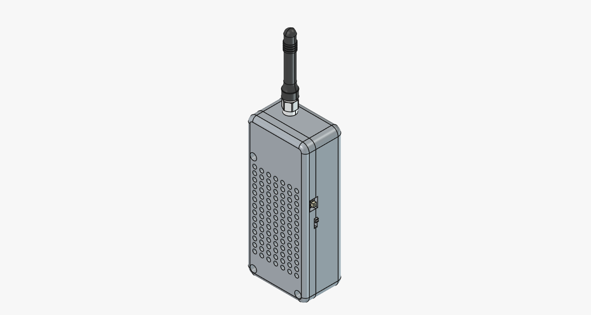
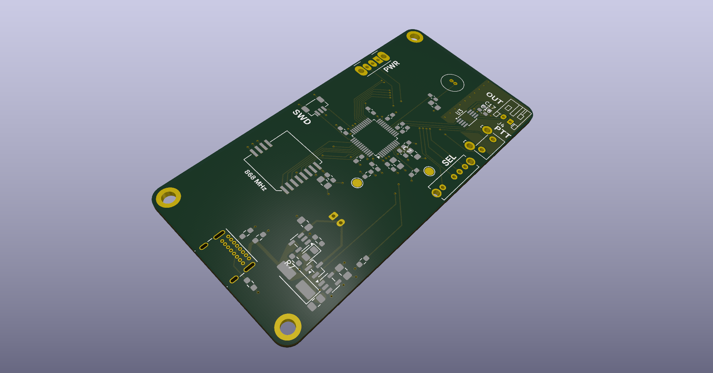
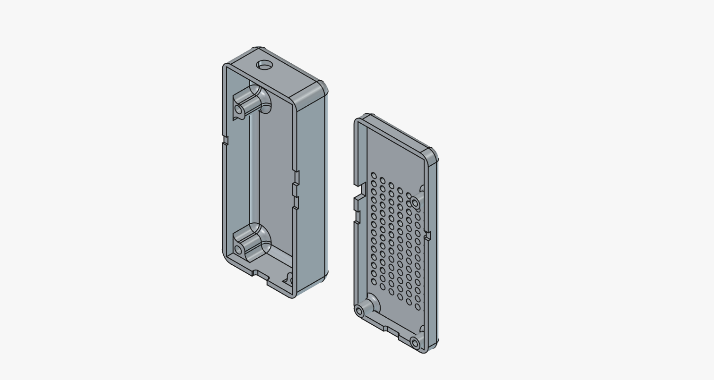
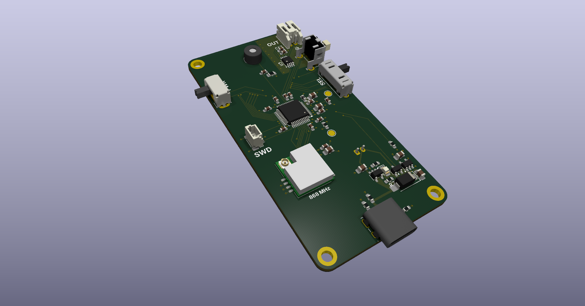
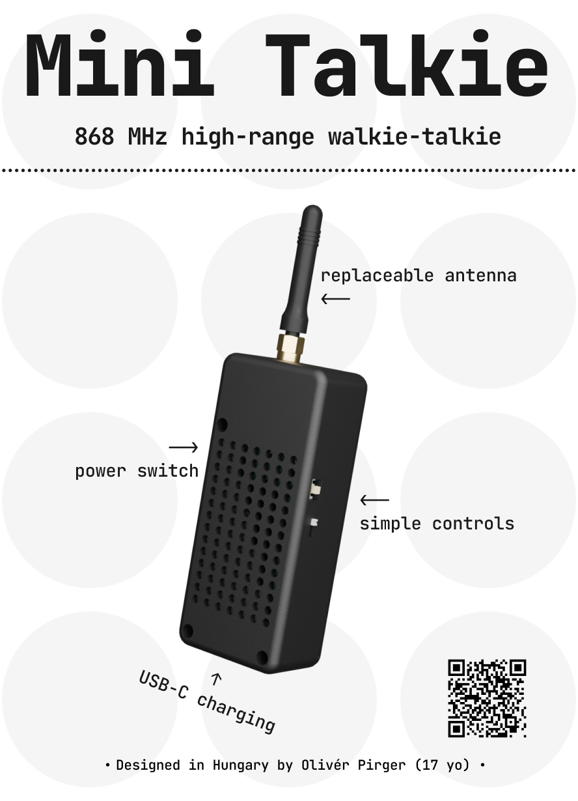

# mini-talkie

A little 868 MHz walkie-talkie with LoRa radio for long ranges with built-in battery and USB-C charging.

### Features:
- 100% off-grid. Works anywhere!
- Long range: multiple kilometers in ideal conditions
- Long battery life: 1200 mAh lithium-polymer battery
- Convenient USB-C charging
- Swappable antenna: use any 868 MHz antenna you want
- Multiple modes: push-to-talk, voice activation
- Small size: fits in your pockets

### Usage:
1. Turn it on using the switch on the left.
2. Start talking! Use the push-to-talk button, or switch to voice activation and talk hands free.
3. Battery low? Plug it in to your regular phone charger.

## Why?
All the walkie-talkies I tried before have too short range, have too many fancy features I would never use, or are very expensive. This walkie-talkie is unique in the way that it uses LoRa radio, making it operate through exceptional ranges. It's also dead simple: no screen, no dials. It doesn't have many extra features, but the ones it has just work. It is also not very expensive to build. It's great for hiking so nobody gets lost, or multiple-car road trips to keep in contact with the other cars without phone calls.

## Assembly
You can actually build a mini-talkie for yourself. All you need is the PCB, SMD components, a speaker, an antenna and internal antenna cable. Below is a rough guide to making one.

### 1. PCB and components

The printed circuit board has to be manufactured somewhere. I recommend [Aisler](https://aisler.net) or [JLCPCB](https://jlcpcb.com), but any similar services work. You can find the source files for the PCB in [/pcb](./pcb). Make sure to order the PCBA (assembly) service if you are not comfortable soldering smaller sized components.

You also need some other components ordered. Check out the [Bill of Materials](./bom.csv) which includes links to help you order them easily.

| Component                          | MPN                | Reference                     | Qty | Link                                                                            |
|------------------------------------|--------------------|-------------------------------|-----|---------------------------------------------------------------------------------|
| 0603 2.2 µF capacitor              | CC0603KRX7R5BB225  | C1,C2                         | 2   | https://www.digikey.hu/short/4rjpq33n                                           |
| 0603 100 nF capacitor              | CC0603KRX7R5BB104  | C3,C4,C5,C6,C7,C9,C14,C18,C19 | 9   | https://www.digikey.hu/short/dt7hb4qj                                           |
| 0805 10 µF capacitor               | CL21A106KQFNNNG    | C8,C10,C11,C12,C13,C20        | 6   | https://www.digikey.hu/short/tvz058r0                                           |
| 0603 1 µF capacitor                | CL10A105KQ8NNNC    | C15,C16                       | 2   | https://www.digikey.hu/short/z9n48j83                                           |
| 0603 10 µF capacitor               | GRM188R60J106KE47D | C17                           | 1   | https://www.digikey.hu/short/4j9w29qw                                           |
| Schottky diode                     | B0520WS-7-F        | D1                            | 1   | https://www.digikey.hu/short/ht5bt73v                                           |
| 0805 orange LED                    | LTST-C170KFKT      | D2                            | 1   | https://www.digikey.hu/short/45p872b7                                           |
| 0603 ferrite bead 600 Ω @100 MHz   | BLM18KG601SN1D     | FB1                           | 1   | https://www.digikey.hu/short/0mqd98np                                           |
| SWD connector                      | BM03B-SRSS-TB      | J1                            | 1   | https://www.digikey.hu/short/5p581w55                                           |
| USB-C receptacle                   | USB4085-GF-A       | J2                            | 1   | https://www.digikey.hu/short/b77q7dpn                                           |
| battery connector                  | S2B-PH-K-S         | J3                            | 1   | https://www.digikey.hu/short/4j185jz8                                           |
| speaker connector                  | S2B-PH-K-S         | J4                            | 1   | https://www.digikey.hu/short/4j185jz8                                           |
| microphone                         | TOW-3050P-B-R      | MK1                           | 1   | https://www.digikey.hu/short/pvdf25rr                                           |
| MOSFET                             | AO3401A            | Q1                            | 1   | https://www.digikey.hu/short/8rwf7289                                           |
| 0603 10 kΩ resistor                | RC0603FR-0710KL    | R1,R4,R5,R6                   | 4   | https://www.digikey.hu/short/b31dpcpj                                           |
| 0603 5.1 kΩ resistor               | RC0603FR-075K1L    | R2,R3,R7                      | 3   | https://www.digikey.hu/short/q0d4nh3t                                           |
| 0805 1 kΩ resistor                 | ESR10EZPF1001      | R8                            | 1   | https://www.digikey.hu/short/5hnt9d3r                                           |
| SP3T sliding right-angle switch    | OS103011MA7QP1C    | SW1                           | 1   | https://www.digikey.hu/short/jz8f2558                                           |
| SPDT sliding right-angle switch    | OS102011MA1QN1     | SW2                           | 1   | https://www.digikey.hu/short/1v0t4jtn                                           |
| SPST right-angle pushbutton switch | B3F-3152           | SW3                           | 1   | https://www.digikey.hu/short/0rj93f0h                                           |
| microcontroller                    | STM32H503CBT6      | U1                            | 1   | https://www.digikey.hu/short/n7f3hf4p                                           |
| LoRa chipset                       | 114993390          | U2                            | 1   | https://www.digikey.hu/short/prpdvndd                                           |
| amplifier                          | PAM8302AASCR       | U3                            | 1   | https://www.digikey.hu/short/0pzv4hpb                                           |
| battery charger                    | MCP73831T-2ACI/OT  | U4                            | 1   | https://www.digikey.hu/short/wfqbhvzq                                           |
| 3.3V LDO voltage regulator         | RT9080-33GJ5       | U5                            | 1   | https://www.digikey.hu/short/2h9019td                                           |
| speaker                            | 4227               | -                             | 1   | https://www.digikey.hu/short/59fcjjq4                                           |
| antenna                            | GHX-325ASA3B       | -                             | 1   | https://www.digikey.hu/short/fqjjtd0b                                           |
| antenna cable                      | 18568              | -                             | 1   | https://www.digikey.hu/short/jn7jd79m                                           |
| battery                            | AKY0622            | -                             | 1   | https://www.tme.eu/hu/details/aky-lp883440/akkumulatorok/akyga-battery/aky0622/ |
| 2-pin JST PH cable                 | 4714               | -                             | 1   | https://www.digikey.hu/short/8mm8t1d7                                           |

Total cost of components: $38,82/unit (excl. taxes)

### 2. Printed parts

mini-talkie's enclosure is made from 2 parts. These have to be made on a 3D printer. If you don't have access to a 3D priner, explore services like [JLC3DP](https://jlc3dp.com) that print and ship the parts to you.

You can find the source files and exported models in STL and STEP formats in [/3d](./3d).

### 3. Soldering

A fine-tipped soldering iron and some flux is needed for this part. Refer to the PCB source files in [/pcb](./pcb) as a reference for placing the correct parts.

Skip this step if you ordered your PCBs assembled (PCBA).

In addition, you need to remove the included connectors from the speaker and battery and solder on the 2-pin JST PH connectors you ordered instead. You need to do this even if you ordered a PCBA.

### 4. Programming

You need a Raspberry Pi Zero (2) or a separate debugger. Connect it to the SWD port on the circuit board and load the firmware from [/firmware](./firmware).

> TODO: Complete this part with instructions once the code is actually done.

### 5. Assembly
1. Insert 3 threaded inserts in the correct holes on the bottom enclosure. Appropriate tools are needed for this step.
2. Install the antenna cable using the included washers and nut.
3. Peel the protective layer off the adhesive on the speaker and stick it on the top enclosure, behind the speaker grille, but in a way that it won't obstruct the microphone.
4. Drop the battery into the compartment under where the PCB goes and plug it into the board.
5. Place the board on the bottom enclosure so that the battery connector is facing down.
6. Plug in the speaker to the board, and put the top enclosure on the bottom, then screw all the M2.5 screws into the top enclosure. Those 3 screws hold everything together, so make sure they are secure.
7. Compete the build by installing your SMA antenna on the top.

## Fallout Zine

